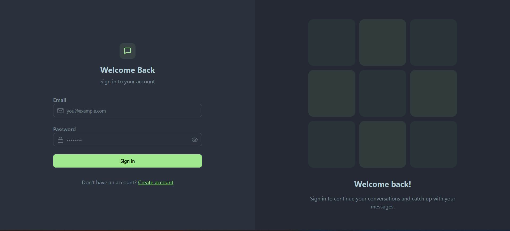
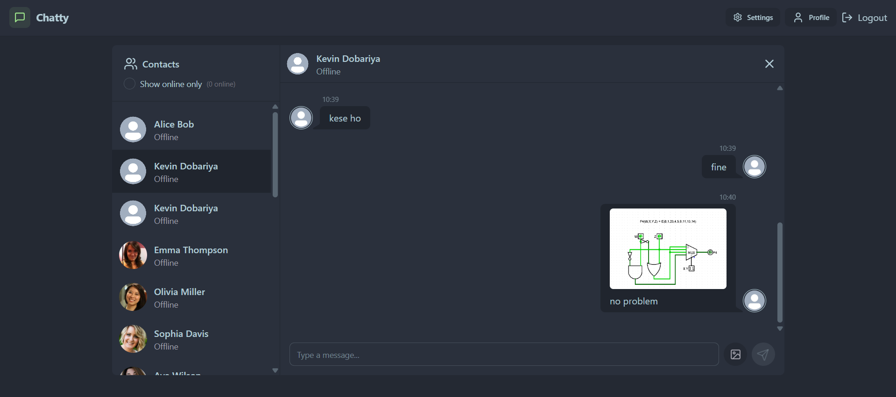
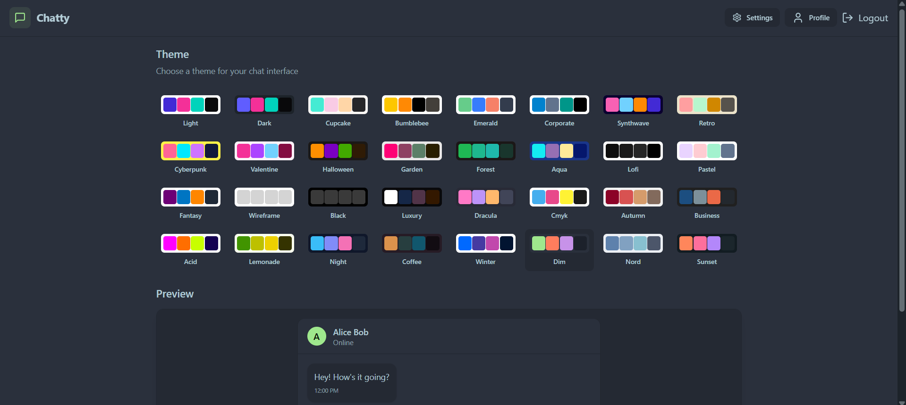

# Chatty 💬

A full-stack **real-time chat application** with support for text messaging, image sharing, and 32 unique UI themes!  
Built using modern technologies like **ReactJS**, **Express**, **MongoDB**, **Cloudinary**, and **Zustand** for state management.  
Live Demo 👉 [chatty.com](https://chattz.up.railway.app/)

---

## ✨ Features

- 🔒 User authentication (Register/Login/Logout)
- 💬 Real-time messaging (socket.io)
- 🖼️ Image sharing via Cloudinary
- 🎨 32 switchable UI themes with [DaisyUI](https://daisyui.com/)
- 🧠 Global state management with Zustand
- 👤 Profile sidebar with all users
- ✅ Fully responsive design

---

## 📸 Screenshots

<!-- Add some screenshots in the /screenshots directory and update links -->




---
## 🛠 Tech Stack

### Frontend:
- [ReactJS](https://reactjs.org/)
- [Tailwind CSS](https://tailwindcss.com/)
- [DaisyUI](https://daisyui.com/)
- [Lucide React](https://lucide.dev/)
- [Zustand](https://github.com/pmndrs/zustand)
- [Socket.io-client](https://socket.io/)

### Backend:
- [Node.js](https://nodejs.org/)
- [Express.js](https://expressjs.com/)
- [MongoDB](https://www.mongodb.com/)
- [Mongoose](https://mongoosejs.com/)
- [Cloudinary](https://cloudinary.com/)
- [Socket.io](https://socket.io/)

---

## 🚀 Getting Started

### Prerequisites:
- Node.js and npm
- MongoDB instance (local or cloud)
- Cloudinary account

---

### Clone the repo:

```bash
git clone https://github.com/Kevin-Dobariyaa/Chat-App.git
cd chatty
```

### Backend Setup:
```bash
cd backend
npm install
```
#### Create a `.env` file in the backend folder:

#### Run Backend:
```bash
npm run start
```

### Frontend Setup:
```bash
cd ../frontend
npm install
```

#### Start frontend:
```bash
npm run dev
```

### 🤝 Contributing
Contributions are welcome! Feel free to fork the project, raise issues, and submit pull requests.